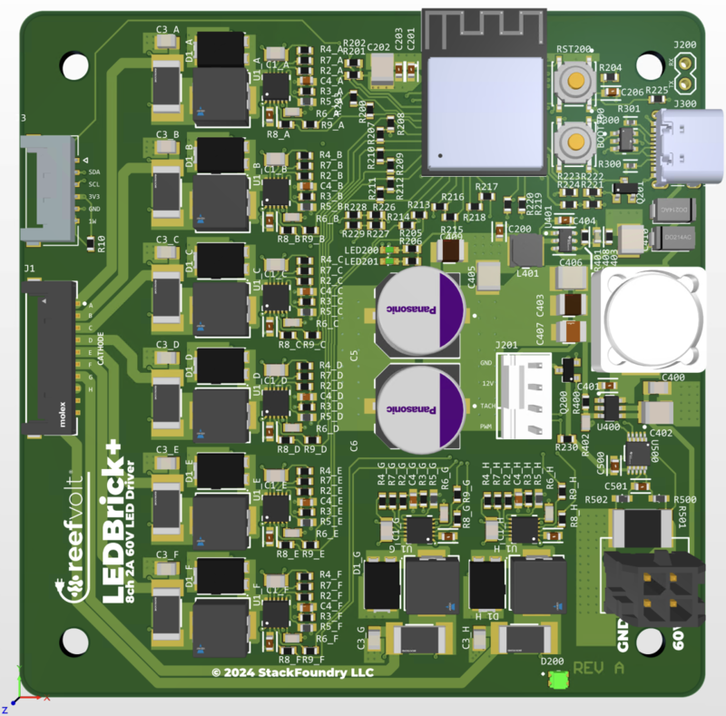
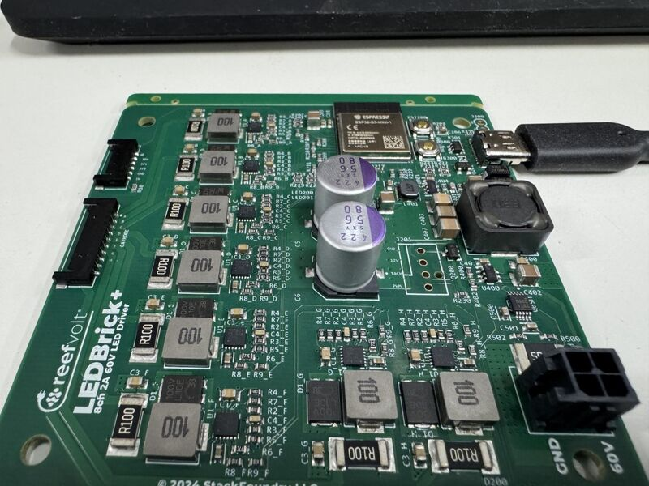
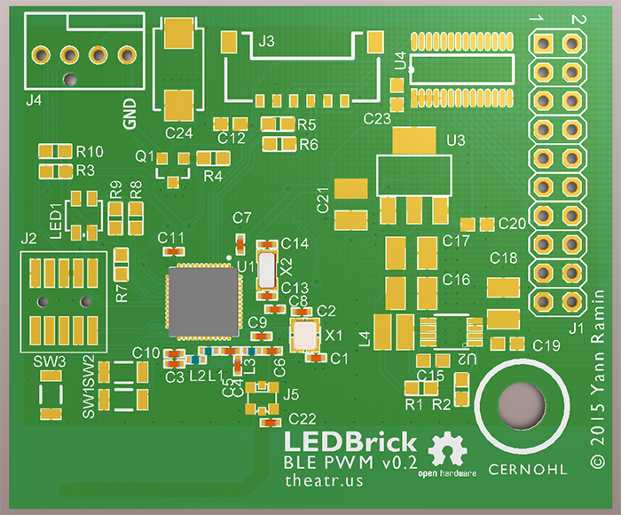

# LEDBrick Project

[](https://github.com/theatrus/ledbrick/actions/workflows/esphome-build.yml)
[](https://github.com/theatrus/ledbrick/actions/workflows/unit-tests.yml)
[](https://github.com/theatrus/ledbrick/actions/workflows/publish.yml)

Open Hardware design for professional aquarium LED lighting systems.

## LEDBrick Plus - Modern ESP32-S3 Based Controller

The **LEDBrick Plus** is a modern, high-performance 8-channel LED driver designed for aquarium lighting applications. Built around the ESP32-S3 microcontroller and ESPHome firmware, it offers professional-grade control with smart home integration.



*Professional 85×85mm PCB with ESP32-S3 microcontroller and 8-channel TPS922053 LED drivers*



*LEDBrick Plus assembled board showing component placement and professional finish*

### 🚀 Quick Start

**Install firmware directly in your browser:**
👉 **[LEDBrick Plus Web Installer](https://theatrus.github.io/ledbrick/)**

*No downloads or software required - uses WebSerial to flash firmware directly via USB.*

### ⚡ Key Specifications

- **8 Independent LED Channels** with individual PWM and current control
- **High Current Capability**: Up to 2A per channel (scalable design)
- **Wide Voltage Range**: Supports up to 60V input
- **ESP32-S3 Microcontroller**: Dual-core with Wi-Fi connectivity
- **Advanced PWM**: 39kHz flicker-free operation (17 total PWM channels)
- **Precision Current Control**: TPS922053 LED driver chips with 0-2A regulation
- **Environmental Monitoring**: INA228 power monitoring, I2C temperature sensors
- **Fan Control**: 4-wire fan control with RPM monitoring
- **Status Indication**: WS2812 RGB LED with customizable effects
- **Temperature Expansion**: 1-Wire bus for DS18B20 temperature sensors
- **Home Assistant Integration**: Native API with automatic discovery
- **Professional Form Factor**: 85×85mm board designed for marine environments

### 🏠 Smart Home Integration

- **ESPHome Native**: Full Home Assistant integration out of the box
- **Web Interface**: Built-in configuration and monitoring
- **OTA Updates**: Wireless firmware updates
- **MQTT Compatible**: Optional MQTT broker support
- **RESTful API**: HTTP API for custom integrations

### 🎛️ Advanced Control Features

- **Individual Channel Control**: Independent PWM brightness and current limiting
- **Smart Current Limiting**: Configurable per-channel maximum current with real-time enforcement
- **Programmable Schedules**: Sunrise/sunset simulation and custom lighting programs
- **Temperature Monitoring**: I2C sensor integration for thermal management
- **Power Monitoring**: Real-time current and voltage monitoring via INA228

### 🔧 Technical Details

**Microcontroller**: ESP32-S3 (Dual-core, 240MHz, Wi-Fi)
**LED Drivers**: 8× TPS922053 constant current drivers
**PWM Frequency**: 39kHz (MCPWM) + 16kHz (LEDC)
**Current Range**: 0-2A per channel (1A default limit)
**Input Voltage**: 12-60V DC
**Communication**: Wi-Fi, USB-C, I2C expansion
**Dimensions**: 85×85mm

For detailed forum discussion and community support, see: [Reef2Reef LEDBrick Thread](https://www.reef2reef.com/threads/ledbrick-diy-led-pendant-with-pucks.243746/)

---

## LEDBrick Classic - Original Design

The original LEDBrick design consists of two main components for DIY aquarium LED lighting.

### Emitter Board

The emitter board is a custom metal-core PCBA designed to hold 8 channels of LEDs from Cree (XP footprint), Osram (SSL and Square), Luxeon (UV and Rebel footprints).



[Design files and gerber files](emitter-board/)

### Bluetooth Low Energy PWM Board (Legacy)

An 8 channel 24VIN + 12VOUT Fan LED dimmer board powered by a Nordic nRF51 Bluetooth Low Energy microcontroller.

[Firmware is available for both Keil and GCC compilers](ledbrick-classic/firmware/nordic_nrf51/app/ble_peripheral/ledbrick_pwm/)
[Design files and gerber files](ledbrick-classic/pwm/0.2/)

For legacy documentation and original design details, see the [ReefCentral thread](http://www.reefcentral.com/forums/showthread.php?t=2477205).

---

## Development

### Building Firmware Locally

```bash
# Install uv (Python package manager)
curl -LsSf https://astral.sh/uv/install.sh | sh

# Clone and build
git clone https://github.com/theatrus/ledbrick.git
cd ledbrick/firmware
uv run esphome compile ledbrick-plus.yaml
```

### GitHub Actions

- **Continuous Integration**: Automatic build testing on firmware changes
- **Web Publishing**: Automated deployment of web installer to GitHub Pages
- **Release Management**: Tagged releases automatically build and publish firmware

## License

Open Source Hardware - see individual component licenses for details.